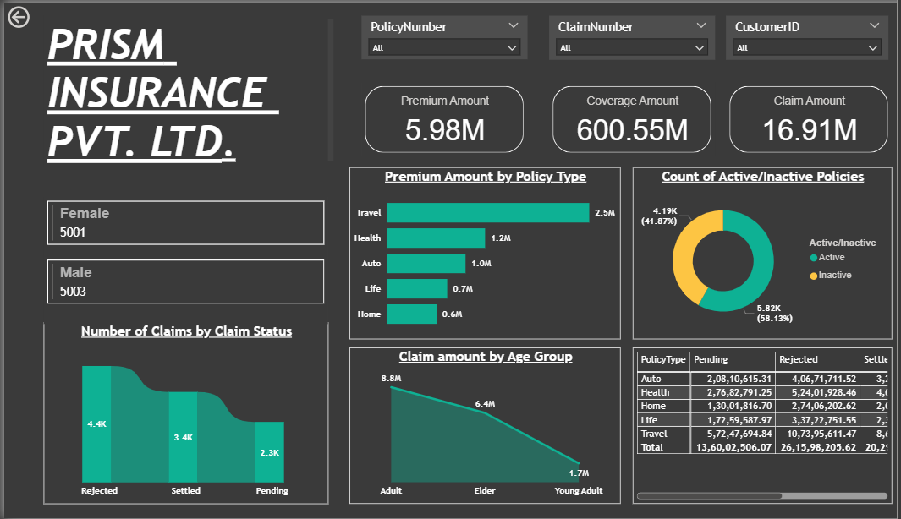

# -Insurance-Data-Dashboard-with-Power-BI-PostgreSQL

A hands-on **Power BI project** simulating a real-world insurance analytics workflow. This project connects **PostgreSQL database** data directly to Power BI and demonstrates interactive dashboards, data profiling, and visualization techniques for insurance datasets.

---

## 📝 Project Overview

In this project, I explored **insurance-related data** including policy details, customer demographics, premiums, coverage, and claims. Unlike typical sample projects, the data was **imported into PostgreSQL** first, reflecting a realistic workflow used in analytics teams.

The dashboard showcases key metrics, interactive visualizations, and dynamic insights, helping users explore patterns in policy types, claim statuses, and customer demographics.

---

## 🛠️ Tech Stack

- **Data Storage:** PostgreSQL  
- **Visualization & Analytics:** Power BI Desktop & Power BI Service  
- **Data Cleaning & Transformation:** Power Query Editor  
- **Security:** Row-Level Security (RLS) in Power BI  
- **Automation:** Scheduled Refresh via Power BI Service  

---

## 📊 Dashboard Highlights

- **Interactive Slicers:** Filter data by policy number, customer ID, or claim number.  
- **Key Metrics Cards:** Total premium collected, coverage provided, and claims paid.  
- **Demographics Analysis:** Multi-row cards showing customer distributions by gender and age group.  
- **Visual Insights:**  
  - Ribbon charts for claim status  
  - Stacked bar charts for premium by policy type  
  - Line charts for claims by age group  
  - Donut charts for active vs. inactive policies  
  - Matrix visuals for policy coverage and claim details  
- **Drill-through Pages:** Detailed view filtered dynamically by selected metrics.  

---

## 💡 Concepts Applied

- **Database Integration:** Direct connection between Power BI and PostgreSQL.  
- **Data Profiling:** Column quality, distribution, and profiling checks before visualization.  
- **Calculated Columns:** Age groups, active/inactive status, and other derived metrics.  
- **Interactivity:** Dynamic filtering across all visuals using slicers and drill-through.  
- **Security:** Row-Level Security (RLS) to control data access per user role.  
- **Automation:** Scheduled refresh to keep dashboards updated automatically.  

---

## 🖼️ Dashboard Screenshot

---

This project is ideal for anyone looking to learn **real-world Power BI workflows**, including database integration, dashboard design, and automation techniques. 🚀
